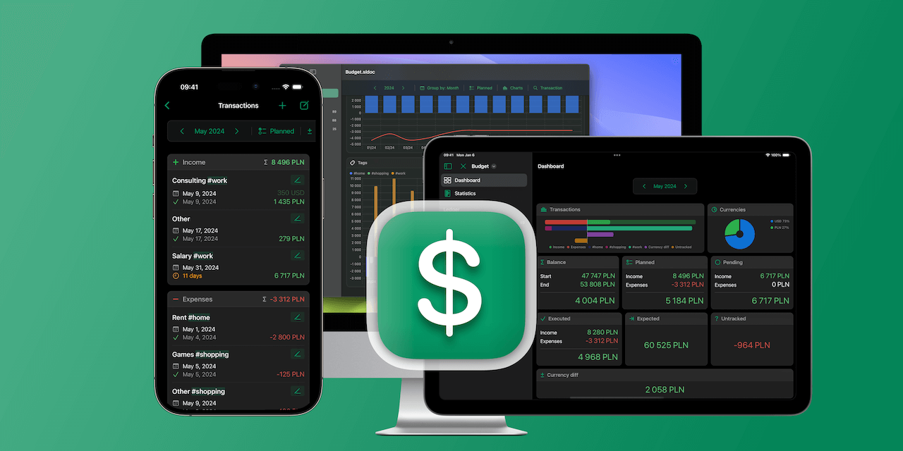
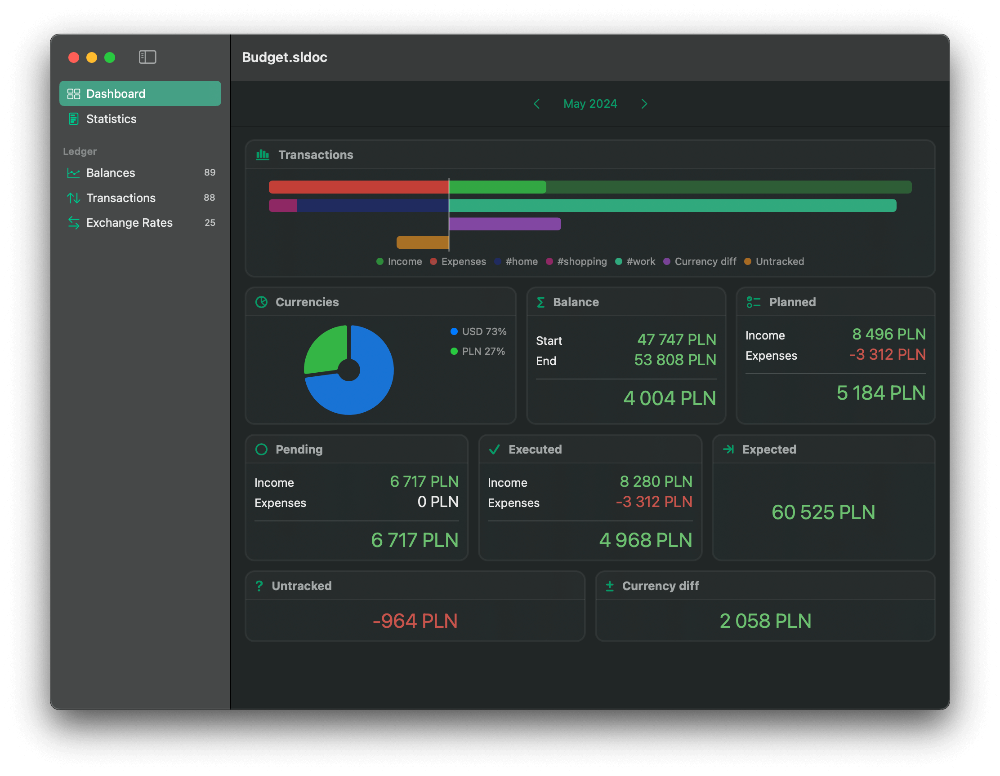
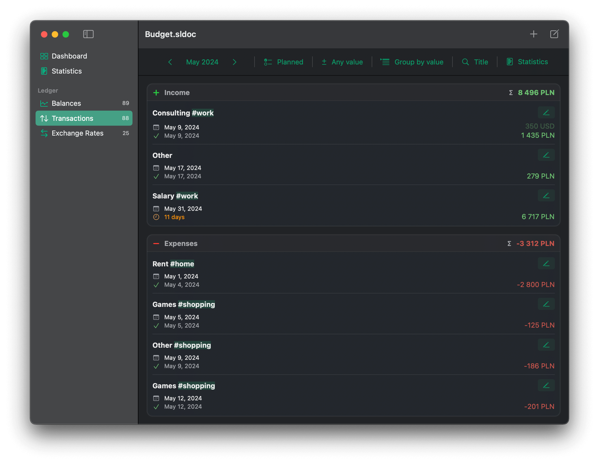
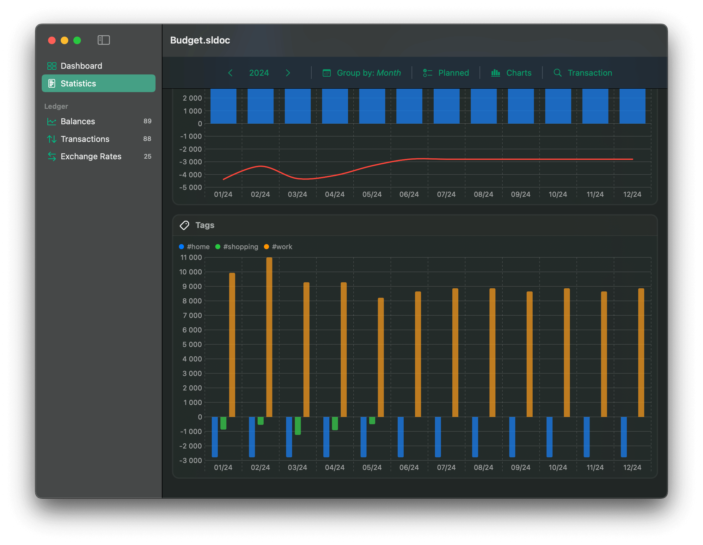
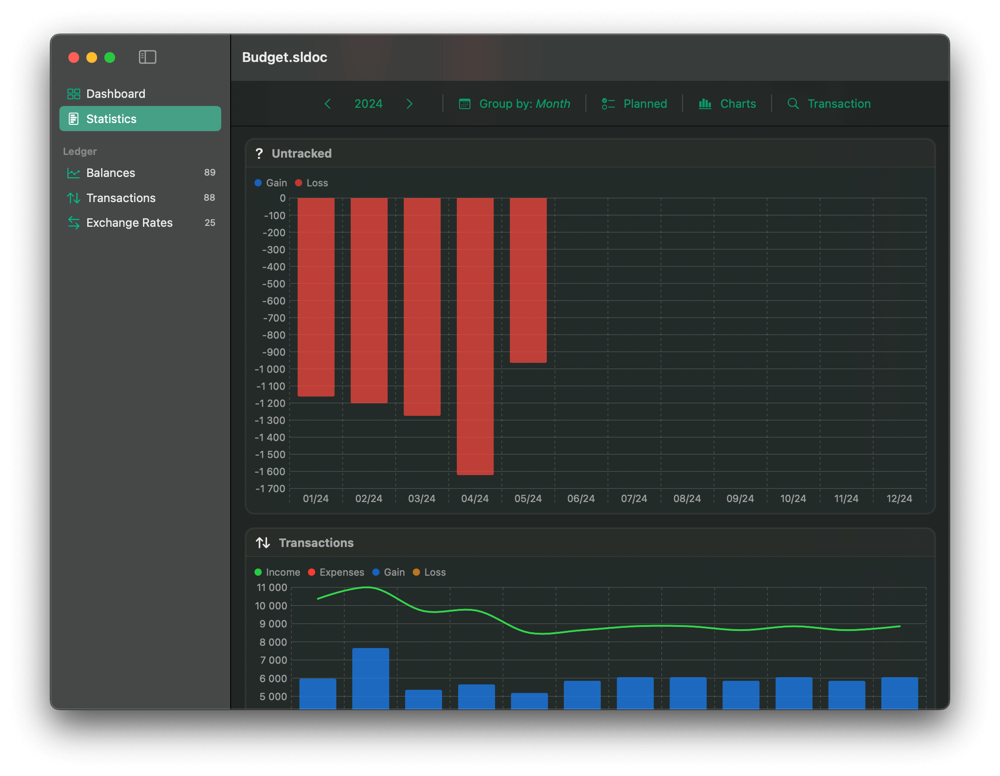
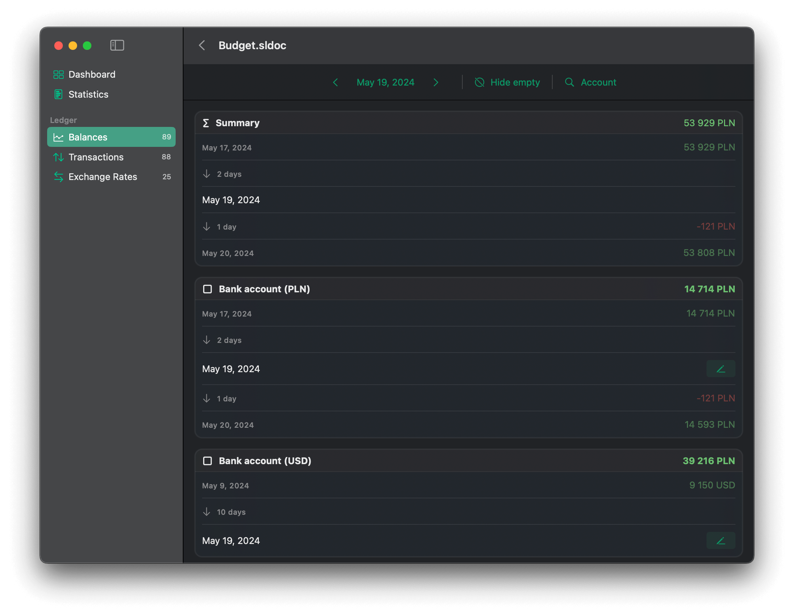
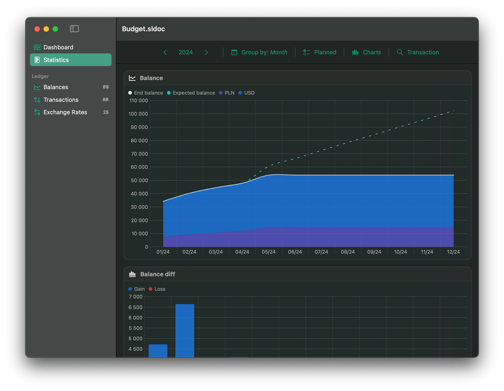
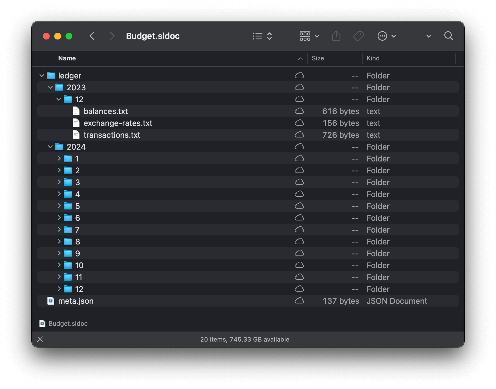
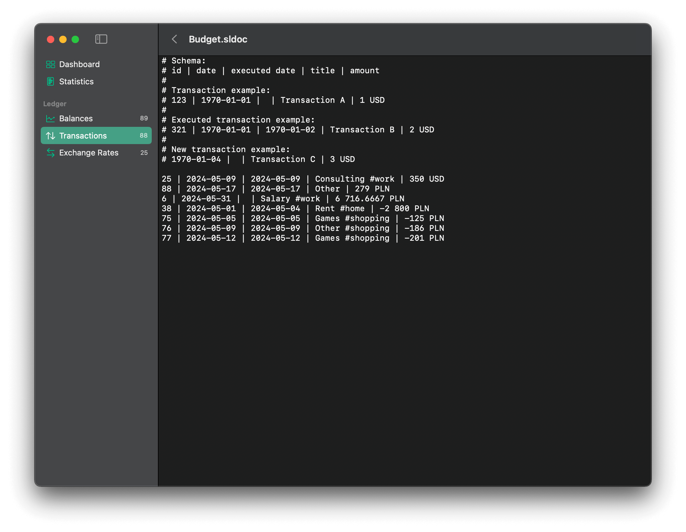

#  Swifty Ledger

Swifty Ledger is a powerful and versatile app designed for iOS and macOS, seamlessly working across your iPhone, iPad, and Mac computers. It empowers you to take control of your personal finances with ease and privacy.

## Author's Note

Swifty Ledger is a passion project that is still under development. The main purpose of building this app was to create a versatile tool that helps manage home budgets totally offline, without uploading any vulnerable data to servers owned by third-party companies. 

I use Swifty Ledger every day to manage more than 10 years of historical budget data. The app is performant, although the UI has some minor issues. 

New features are planned to further improve the user experience. Thank you for your support and patience as Swifty Ledger continues to evolve.

[Visit Swifty Ledger product page.](https://swifty-ledger.darrarski.pl)

## Key features

### 💼 Comprehensive Budget Management 

Swifty Ledger is your go-to app for managing your personal budget. Whether you're tracking daily expenses or planning for the future, Swifty Ledger has you covered.

### 🔒 Privacy First

We respect your privacy. No data is collected or shared with third-party companies. All data entered into Swifty Ledger belongs solely to you.

### 📊 Intuitive Dashboard

The document dashboard provides a clear summary for the selected month, year, or a custom time period, giving you a comprehensive view of your financial status. The dashboard includes a categorized transactions breakdown, a currency breakdown, and even the gain/loss of foreign currency value presented in your preferred currency, ensuring you have all the details you need to manage your budget effectively.

### 💸 Easy Transaction Management

 Add transactions, income, and expenses effortlessly. Swifty Ledger supports various currencies, making it ideal for users with diverse financial portfolios.

### 🏷️ Categorize Transactions

Organize your transactions into categories for better clarity and analysis.

### 📉 Monitors and Visualizes All Expenses
 
Swifty Ledger app monitors and visualizes all income and expenses, including those that are not explicitly added by the user. You can enter the transactions that matter the most, and Swifty Ledger will do the rest to visualize untracked expenses, providing a complete picture of your financial situation.

### 💰 Balances Summary

Monitor the amount of money across multiple accounts, including bank accounts, savings, cash, and more.

### 📈 Insightful Statistics

Gain valuable insights into your budget with detailed statistics, visualized through colorful charts. Understand your spending habits and make informed financial decisions.

### 📄 Flexible Document-Based System

Create multiple documents to cater to different budget needs or share a document with family members for household budget management. Each document is a self-contained unit that you fully control. Documents can be stored on your device or shared with any cloud provider of your choice, such as iCloud, ensuring your data is always accessible and securely backed up.

### 📝 Simple and Accessible Data

Your budget documents have a simple, text-based, human-readable structure. They can be edited in Swifty Ledger or any text editor, allowing for easy import and export of data. This prevents vendor lock-in and ensures your data is always accessible.

### 🗂️ Version Control Compatibility

Because Swifty Ledger documents are text-based, they can be added to a version control system like git, providing an additional layer of data security and version tracking.

## Isses and feature requests

If you are experiencing issues with the app, or would like to suggest some features and improvements - use issues page in this repository.

## Do you like the project?

I would love to hear if you like my work. I can help you apply any of the solutions used in this project in your app too! Feel free to reach out to me, or if you just want to say "thanks", you can buy me a coffee.

## License

Copyright © 2025 [Dariusz Rybicki Darrarski](https://darrarski.pl)
