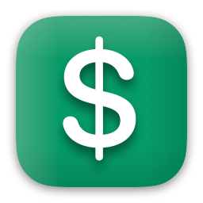

#  Swifty Ledger

Swifty Ledger is an iOS and macOS app for personal budget management.

Your privacy is respected - Swifty Ledger app does not collect or share your data with anyone.

If you are experiencing issues with the app, or would like to suggest some features and improvements - use issues page in this repository.

## ☕️ Do you like the project?

I would love to hear if you like my work. I can help you apply any of the solutions used in this project in your app too! Feel free to reach out to me, or if you just want to say "thanks", you can buy me a coffee.

## 📄 License

Copyright © 2025 [Dariusz Rybicki Darrarski](https://darrarski.pl)
